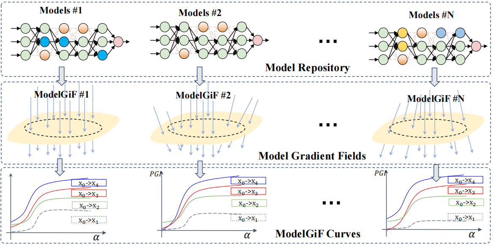

# ModelGiF

This repository is an implementation of the paper [ModelGiF: Gradient Fields for Model Functional Distance]().  We provide theoretical insights into the proposed ModelGiF for model functional distance, and validate the effectiveness of the proposed ModelGiF with a suite of testbeds, including task relatedness estimation, intellectual property protection, and model unlearning verification. For more details, please read the paper.



## Dependency

Our code is implemented and tested on PyTorch. Following packages are used:

```
torch==1.12.1+cu116
numpy==1.23.1
captum==0.5.0
opencv-python==4.6.0.66
pandas
scikit-learn
scikit-image
xlsxwriter
lime
saliency
h5py
tqdm
pillow
```

## Experiments

- [Task Relatedness Estimation](task_relatedness)
- [Intellectual Property Protection](intellectual_property_protection)
- [Model Unlearning Verification](model_unlearning)

## Citation

```
```

