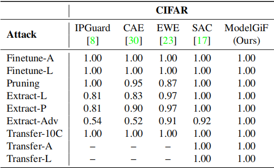
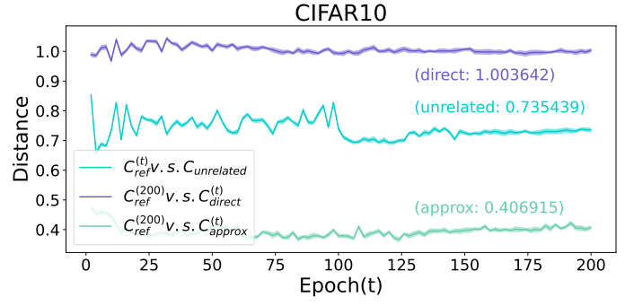

# ModelGiF

This repository is an implementation of the paper [ModelGiF: Gradient Fields for Model Functional Distance]().  We provide theoretical insights into the proposed ModelGiF for model functional distance, and validate the effectiveness of the proposed ModelGiF with a suite of testbeds, including task relatedness estimation, intellectual property protection, and model unlearning verification. For more details, please read the paper.


## Dependencies

Our code is implemented and tested on PyTorch. Following packages are used:

```
torch==1.12.1+cu116
numpy==1.23.1
captum==0.5.0
opencv-python==4.6.0.66
pandas
scikit-learn
scikit-image
xlsxwriter
lime
saliency
h5py
tqdm
pillow
```

You can install pytorch with following command:

```shell
pip install torch==1.12.1+cu116 torchvision==0.13.1+cu116 torchaudio==0.12.1 --extra-index-url https://download.pytorch.org/whl/cu116
```

Then, install the rest of dependencies:

```shell
pip install -r requirements.txt
```

## Experiments

| [Task Relatedness Estimation](task_relatedness)              |
| ------------------------------------------------------------ |
| All the experimental details about task relatedness estimation are provided in the `task_relatedness` folder. |
|  |

| [Intellectual Property Protection](intellectual_property_protection) | [Model Unlearning Verification](model_unlearning)            |
| ------------------------------------------------------------ | ------------------------------------------------------------ |
| This folder contains the experimental details about intellectual property protection with ModelGiF. | All the experimental details about model unlearning verification are provided in the `model_unlearning` folder. |
|  |  |

## Citation

```
@InProceedings{Song_2023_ICCV,
    author    = {Song, Jie and Xu, Zhengqi and Wu, Sai and Chen, Gang and Song, Mingli},
    title     = {ModelGiF: Gradient Fields for Model Functional Distance},
    booktitle = {Proceedings of the IEEE/CVF International Conference on Computer Vision (ICCV)},
    month     = {October},
    year      = {2023}
}
```

## Contact

If you have any question, please feel free to contact

Jie Song, [sjie@zju.edu.cn](mailto:sjie@zju.edu.cn);

Zhengqi Xu, [xuzhengqi@zju.edu.cn](mailto:chenyix@zju.edu.cn).
