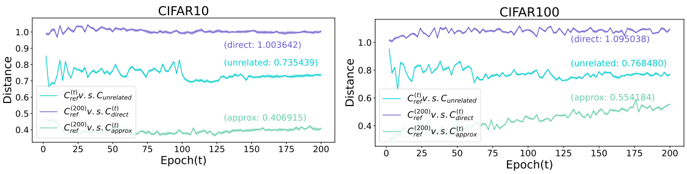

# Model Unlearning Verification with ModelGiF

## Train

Train a reference model

```shell
python main.py --id=0 -g=0
```

Train the unrelated model with several different random seed `-s`.

```shell
python main.py --id=u1 -s=1 -g=0
```

Train directly unlearning model with several different random seed `-s`.
```shell
python main.py --id=dir1 -s=1 --ul -g=0
```

Train approximate unlearning model with several different random seed `-s`.

```shell
python main.py --model-dir=models/ckpt_CIFAR10_0/model_epoch_200 --mix-label --id=app1 -s=1 --ul -g=0
```

## Generate comparison results

```shell
python compare_field.py --rs=cf10_ref_vs_un1 --path1=ckpt_CIFAR10_0 --path2=ckpt_CIFAR10_u1 -g=0
python compare_field.py --rs=cf10_ref_vs_dir1 --path1=ckpt_CIFAR10_0 --path2=ckpt_CIFAR10_dir1 --fix-epoch=200 -g=0
python compare_field.py --rs=cf10_ref_vs_app1 --path1=ckpt_CIFAR10_0 --path2=ckpt_CIFAR10_app1 --fix-epoch=200 -g=0
```

## Visualization

To reproduce the picture in the paper, please execute the training script in the `train.sh` completely.

```shell
python plot.py
```


