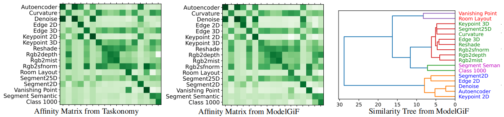
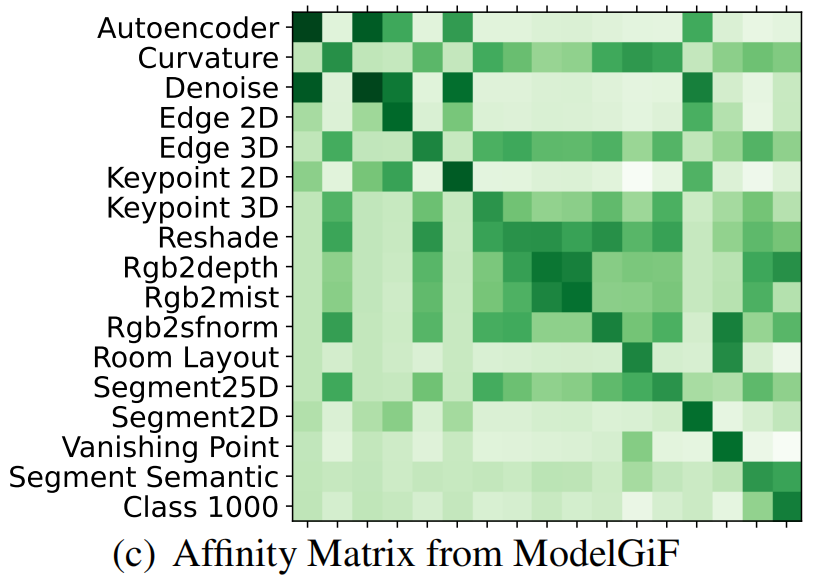
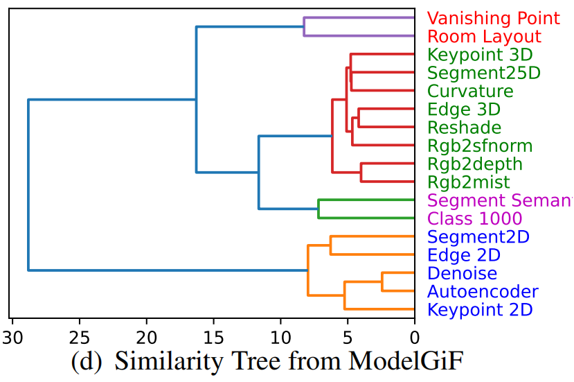

# Task Relatedness Estimation with ModelGiF



## Prepare data and models

Unzip the [reference data(cutmix)](https://drive.google.com/drive/folders/1Fxbo0eEgWUQasvYamu5qqdOB1Y5ur6kT) to `./data`.

- Raw data can be obtained from [taskonomy official depository](https://github.com/StanfordVL/taskonomy/tree/master/data)

Unzip the [taskonomy models](https://github.com/alexsax/visual-prior/tree/networks) to `\${USER_HOME}\$/.cache/torch/hub/checkpoints/`.

- [Taskonomy official depository](https://github.com/alexsax/visual-prior/tree/networks)

## Task relatedness estimation

Generate the gradient field for all taskonomy pretrained models with the specified reference data.

```shell
python generate_field.py --exp=1 -r=./result_featuremap_tk_rb -i=reference_data_cutmix_1000 -p=result_cutmix_1000 -g=0
```

- `-r` The root directory where intermediate results are saved.
- `-i` directory of the reference data
- `-p` The file where the intermediate results are saved in the project\'s directory.
- `-g` Select the gpu according to its id.
- `--exp` Calculate the gradient according to what activation target. As the shape of output(NxCxHxW), 
  - 1 Maximize the sum of the maximum values of all feature maps(HxW) in the last layer. 
  - 5 Maximize the sum of the maximum values of all channels in the last layer. 
  - 6 Maximize the total output of all neurons in the last layer.

Calculate the  affinity matrix and verify that the functionality similarity obtained by ModelGiF positively correlates with that from taskonomy.

```shell
python compare_field.py -d=0 -r=./result_featuremap_tk_rb -p=result_cutmix_1000 -g=1
```

- `-d` Distance measurement. 0 Cosine dissimilarity,1 Euclidean distance
- `-r` The root directory where intermediate results are saved. Keep consistent with `generate_field.py`
- `-p` The file where the intermediate results are saved in the project\'s directory，Keep consistent with `generate_field.py`
- `-g` Select the gpu according to its id.

The results are in the last few lines of the `.log` file from `compare_field.py`.

```
  9.87795949e-01 9.96031106e-01 9.98350918e-01 2.95162206e-09
  9.90921795e-01]
 [9.97791469e-01 9.93405759e-01 9.96294141e-01 9.96240139e-01
  9.93965328e-01 9.97385919e-01 9.95509982e-01 9.93018031e-01
  9.89939630e-01 9.95451331e-01 9.92023647e-01 9.98503745e-01
  9.93933260e-01 9.96004224e-01 9.99510646e-01 9.90921795e-01
  3.08394421e-09]]
[-0.74509804 -0.85294118 -0.76470588 -0.89460784 -0.88480392 -0.90196078
 -0.86029412 -0.92647059 -0.95343137 -0.95588235 -0.81617647 -0.76960784
 -0.80637255 -0.86764706 -0.91666667 -0.71323529 -0.56372549]
./result_featuremap_tk_rb/result_cutmix_1000
Spearman correlation: -0.8349192618223761
```

## Visualization

### Visualize affinity matrix

```
python plot_heatmap.py
```

- If you want to visualize the other affinity matrix, please modify the variable `affi` in the `plot_heatmap.py`  manually. 
- The affinity matrix of ModelGiF can be obtained in the last few lines of the `.log` file from `compare_field.py`.



### Similarity tree

```shell
python plot_tree.py
```

- If you want to plot the similarity tree by other affinity matrix, please modify the variable `affi` in the `plot_tree.py`  manually. 
- The affinity matrix of ModelGiF can be obtained in the last few lines of the `.log` file from `compare_field.py`.


